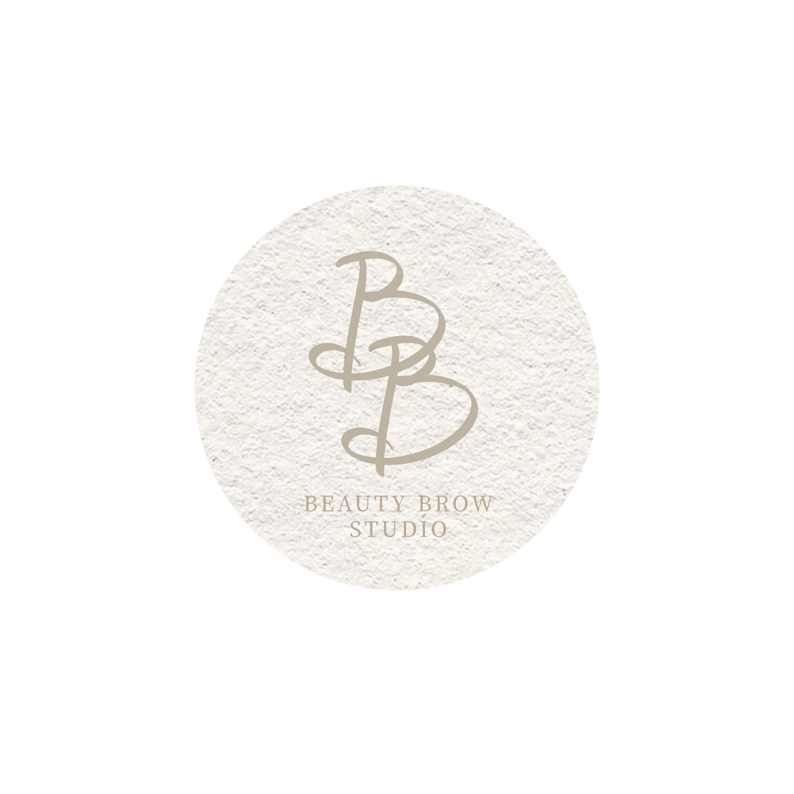

# 美眉 ｜ 美學 - 專業霧眉工作室



專業半永久霧眉 · 原生感風格

## 🌐 線上預覽

本網站託管於 GitHub Pages：

**網址：** [https://yoyobook.github.io/BeautyBrow-Studio/](https://yoyobook.github.io/BeautyBrow-Studio/)

## ✨ 網站特色

- 📱 **全響應式設計** - 完美適配手機、平板、桌面裝置
- 🎨 **優雅視覺設計** - 溫暖的玫瑰金色系與柔和圓角設計
- 💡 **互動式臉型指南** - 點擊查看六種臉型的專業眉型建議
- 📋 **完整服務資訊** - 價目表、預約須知、照護指南等
- 🗺️ **雙店資訊** - 台北大安店與板橋新埔店位置

## 📑 網站內容

### 頁籤導覽
1. **首頁** - 品牌理念與服務介紹
2. **眉型設計指南** - 六種臉型專業分析
   - 鵝蛋臉 | 心形臉 | 長型臉 | 圓型臉 | 方形臉 | 菱形臉
3. **價目表** - 霧眉與淡色服務價格
4. **預約須知** - 預約流程與注意事項
5. **施作前準備** - 霧眉前的準備工作
6. **照護須知** - 霧眉與淡色的術後護理
7. **服務地點** - 工作室地址與交通資訊
8. **霧眉Q&A** - 常見霧眉問題解答
9. **淡色Q&A** - 常見淡色問題解答

### 臉型設計指南特色
- **互動式設計** - 點擊臉型卡片查看詳細說明
- **專業內容** - 包含推薦眉型、設計美學、設計小巧思
- **精美浮層** - 優雅的彈出視窗顯示完整資訊
- **手機優化** - 針對移動裝置特別優化的互動體驗

## 🛠 技術棧

- **前端框架** - 純 HTML + JavaScript（原生）
- **CSS 框架** - Tailwind CSS（CDN）
- **響應式設計** - Mobile-first 設計理念
- **動畫效果** - CSS Animations + Transitions
- **圖片資源** - JPG/PNG 格式，優化壓縮

## 📂 專案結構

```
BeautyBrow-Studio/
├── index.html          # 主頁面（單頁應用）
├── sources/            # 資源文件夾
│   ├── logo.png       # 品牌標誌
│   ├── copy-icon.png  # 複製圖標
│   ├── studio_env.png # 大安店環境圖
│   ├── 新埔店.png      # 新埔店地圖
│   ├── 鵝蛋臉.jpg      # 臉型示意圖
│   ├── 心型臉.jpg
│   ├── 長型臉.jpg
│   ├── 圓型臉.jpg
│   ├── 方型臉.jpg
│   └── 菱形臉.jpg
├── .nojekyll          # GitHub Pages 配置
└── README.md          # 本文件
```

## 🚀 部署說明

本專案使用 GitHub Pages 自動部署：

1. 推送代碼到 `main` 分支
2. GitHub Pages 自動構建並發布
3. 訪問 `https://yoyobook.github.io/BeautyBrow-Studio/` 查看最新版本

### 本地開發

直接在瀏覽器中打開 `index.html` 即可預覽：

```bash
open index.html  # macOS
start index.html # Windows
```

或使用本地服務器：

```bash
# 使用 Python
python -m http.server 8000

# 使用 Node.js
npx serve
```

## 🎨 設計規範

### 色彩系統
- **主色調** - `#C7A290` 玫瑰金
- **次要色** - `#E8D5C8` 淺杏色
- **背景色** - `#FAF8F6` 米白色
- **文字色** - `#5C4A42` 深褐色

### 字體系統
- **主字體** - Noto Sans TC
- **標題字體** - 可畫書寫行楷（備用：標楷體）
- **基礎字號** - 13.5px

### 圓角設計
- **小圓角** - 16px
- **中圓角** - 20-24px
- **大圓角** - 9999px（完全圓形）

## 📱 聯絡方式

- **Instagram** - [@beautybrow_studio](https://www.instagram.com/beautybrow__studio)
- **LINE** - @816winfr

## 📍 服務地點

### 台北｜大安店
📍 台北市大安區復興南路二段 11-1 號 12 樓  
🚇 捷運大安站 4 號出口 散步30秒

### 板橋｜新埔店
📍 新北市板橋區莊敬路 140 巷 10 號 1 樓  
🚇 捷運新埔 4 號出口 散步4分鐘

## 📄 授權

© 2024-2026 美眉｜美學 BeautyBrow Studio. All rights reserved.

---

✨ **讓每個人都能擁有最適合自己的完美眉型** ✨

